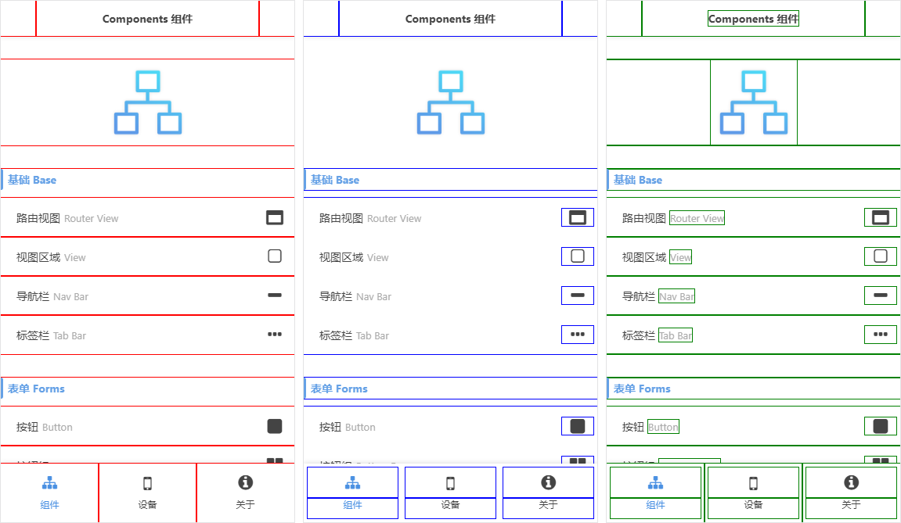
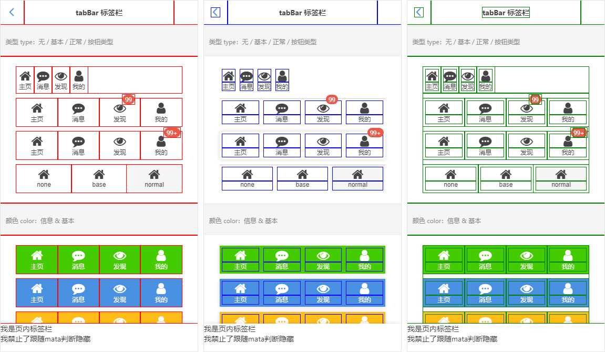

# Componentized-name-rules(neo组件化命名规范)

<br/>

这是一套可以应用在任何界面的简单的组件化命名解决方案（即使是纯html、css环境依然适用），特别适合包装不需要独立组件化的代码。

**优点：样式定位准确，逻辑清晰，规则简单，可读性高，一目了然，无冲突，可复用。只需要一两种选择器就可以选择任何想要选择的元素。**

<br/>

## 统一原则：

(前缀"_全局||不相关") (PG||UI) (-分割) (驼峰名称)

*<b>注意："UI"不是固定的，我们可以换成企业代号如（TB，JD等）。</b>*

```
// 页面
PG-name
  name_PG-子页面
  
    // 全局组件
    _UI-xxx  定义组件
      ├ui-x-xxx    定义子元素
      └─ui-xx-xxx    定义子元素
    
    // 页内组件
    UI-xxx  定义组件
      ├ui-x-xxx    定义子元素
      └─ui-xx-xxx    定义子元素
```

```
// 全局组件
_UI-aaa
├ui-a-aaa
├ui-a-bbb
└─ui-ab-ccc
└──ui-abc-ddd

// 页内组件
UI-bbb
├ui-b-aaa
├ui-b-bbb
└─ui-bb-ccc
└──ui-bbc-ddd
```

```
// css全局样式（无前缀）应用：class=“UI-xxx _pa _cl-aaa”
_pa
_pr
```

```
// 选择器
(.name_PG-index .UI-aaa .ui-a-xxx)
```

**本规范不限定任何使用方式，你可以自由调整。（规则是死的，人是活的。）**

<br/>
<br/>

## 截图 组件 | 组件-子组件 | 组件-所有子元素

```
/* 所有UI组件 */
*[class*="UI-"]{/* outline: 1px solid red !important; */}
/* 所有UI组件-子元素 */
*[class*="UI-"] *[class*="ui-"]{/* outline: 1px solid blue !important; */}
/* 所有UI组件-所有子元素 */
*[class*="UI-"] *{/* outline: 1px solid green !important; */}
```

<br/>



<br/>



### 实例代码：

[vha-appDemo (Github)](https://github.com/neoStudioGroup/vha-appDemo)
